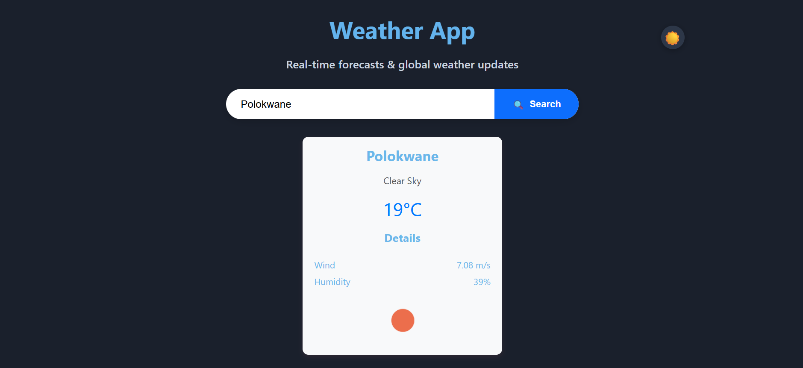
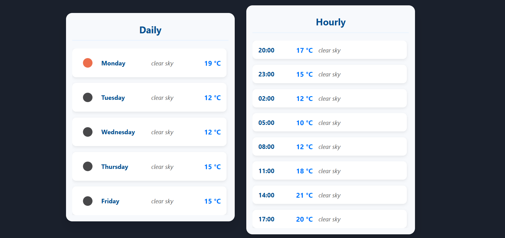
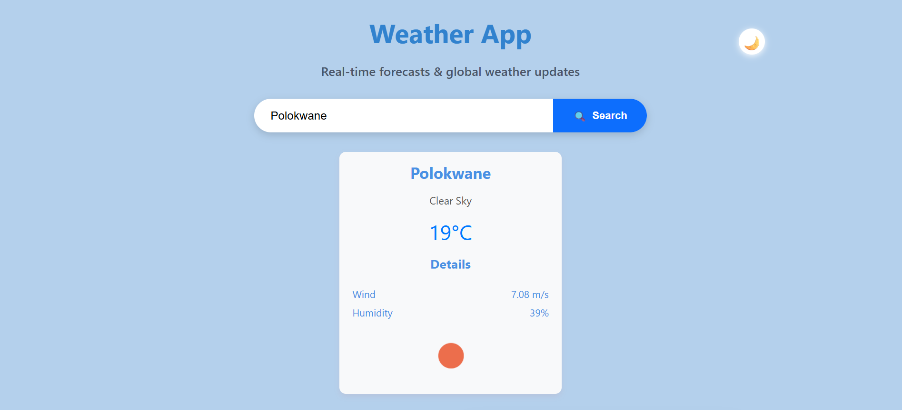
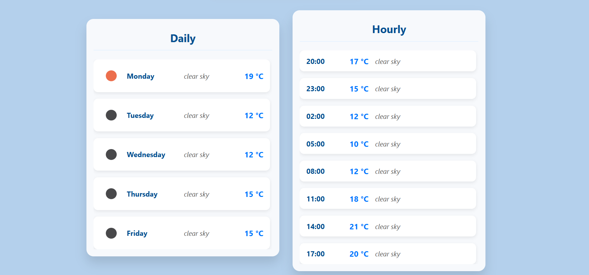

🌦️ Weather App
A modern weather application built with React and TypeScript, deployed on Netlify.
It provides real-time weather updates, hourly forecasts, and daily forecasts using the OpenWeather API.

✨ Features
🔍 Search for current weather by city name
🌡️ Real-time temperature, humidity, wind speed, and conditions
🕒 Hourly forecast with expandable details
📅 7-day forecast with daily insights
📱 Fully responsive design

Technologies Used
React
TypeScript
CSS
Vite
API: OpenWeather API
Deployment: Netlify

Setup Instructions

git clone https://github.com/DIMPHO290/react-weather-app.git
cd react-links-vault
npm install
npm create@vite.4.1.0 .
npm run dev

### How add the AIP KEY to env file

-create the .env file

-VITE_WEATHER_API_KEY= "USE_YOUR_OWN_API_KEY"
npm start

Screenshots :

### Full Application

### Dark mode

### Light mode

### Live Demo on Netlify

https://deploy-preview-6--helpful-crumble-ed9278.netlify.app/
